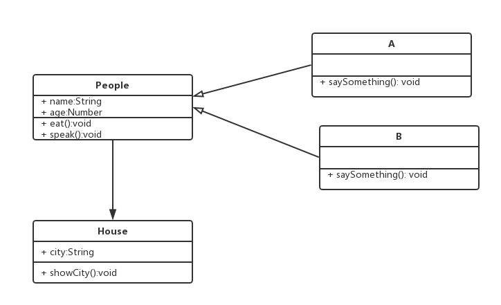
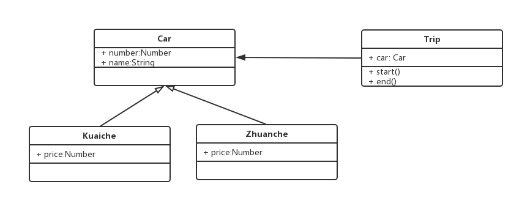
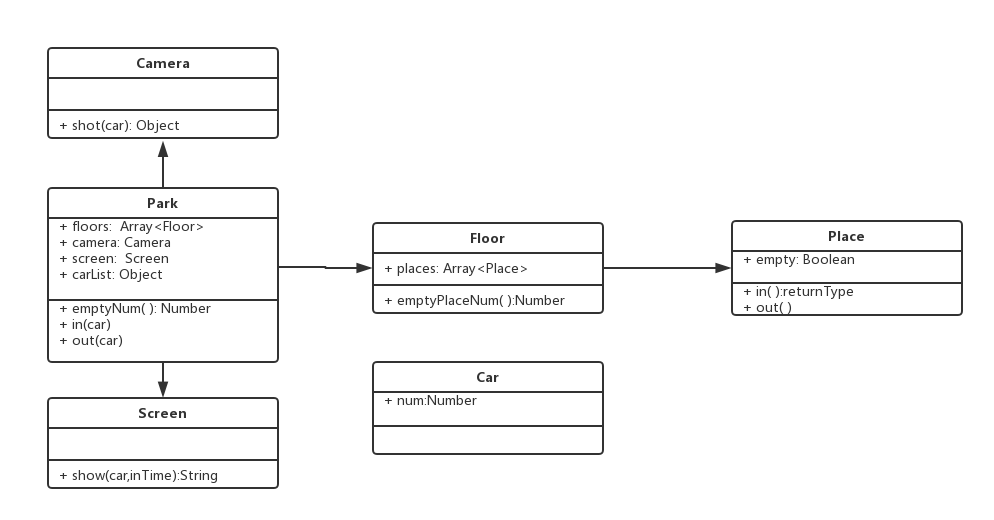

## 设计模式

## NO_01  面向对象

- 环境的初始化搭建

```bash

npm install webpack webpack-cli --save-dev

npm install webpack-dev-server html-webpack-plugin --save-dev

npm install babel-core babel-loader babel-polyfill babel-preset-es2015 babel-preset-latest --save-dev  

```

###  面向对象的继承

- 三要素-继承
>People是父类，公共的，不仅仅服务于Student
继承可将公共方法抽离出来，提高服用，减少冗余

```javascript

    class People {
        constructor(name, age) {
            this.name = name
            this.age = age
        }
        getName(){
            return this.name
        }
        eat(){
            alert(`${this.name} eat something`)
        }
        speak(){
            alert(`My name is ${this.name}, age ${this.age}`)
        }
    }
    
    let zhang = new People("zhang",20)
    
    zhang.eat()
    
    zhang.speak()
    
    let wang = new People("wang",21)
    
    wang.eat()
    
    wang.speak()
    
    // 子类 继承父类
    
    class Student extends  People
    {
        constructor(name, age, number) {
            super(name, age)
            this.number = number
        }
        study(){
            alert(`${this.name} study`)
        }
    }
    
    let xiaoming = new Student('xiaoming', 10, 'A1')
    
    xiaoming.study()
    
    alert(xiaoming.number)
    
    xiaoming.eat()
    
    let xiaohong  = new Student('xiaohong',11,'A2')
    
    xiaohong.study()
    
    alert(xiaohong.number)
    
    xiaohong.speak()

```


### 面向对象的封装

- 三要素-封装

> public 完全开放

> protected 对子类开放

> private 对自己开发

>（ES6 尚不支持，可以用TypeScript来演示）
  
> 减少耦合，不该外露的不外露

> 利于数据、接口的权限管理

> ES6目前不支持，一般认为_开头的属性是private
  
  
```typescript

    //www.typescriptlang.org/play/
    
    class People {
    
        name
    
        age
    
        protected weight
    
        constructor(name, age) {
    
            this.name = name
    
            this.age = age
    
            this.weight = 120
    
        }
        getName(){
            return this.name
        }
        eat(){
            alert(`${this.name} eat something`)
        }
        speak(){
            alert(`My name is ${this.name}, age ${this.age}`)
        }
    }
    
    let zhang = new People("zhang",20)
    
    zhang.eat()
    
    zhang.speak()
    
    let wang = new People("wang",21)
    
    wang.eat()
    
    wang.speak()
    
    // 子类 继承父类
    
    class Student extends  People
    {
        number
    
        private girlfriend
    
        constructor(name, age, number) {
    
            super(name, age)
    
            this.number = number
    
            this.girlfriend = 'xiaoli'
    
        }
        study(){
            alert(` ${this.name}  study`)
        }
        getWeight(){
            alert(` weight  ${this.weight}`)
        }
    }
    
    let xiaoming = new Student('xiaoming', 10, 'A1')
    
    xiaoming.getWeight()
    
    // alert(xiaoming.girlfriend)

```

### 面向对象的多态

- 三要素-多态

>  同一个接口，不同的表现

>  JS应用极少

>  需要结合Java等语言的接口、重写、重载等功能

>  保持子类的开发性和灵活性

>  面向接口编程

> （JS引用极少，了解即可）
  
```javascript

    class People {
        constructor(name){
            this.name = name
        }
        saySomething(){
    
        }
    }
    
    class  A extends People{
        constructor(name){
            super(name)
        }
        saySomething(){
            alert('I am A')
        }
    }
    
    class  B extends People{
        constructor(name){
            super(name)
        }
        saySomething(){
            alert('I am B')
        }
    }
    
    let a = new A('a')
    
    a.saySomething()
    
    let b = new B('b')
    
    b.saySomething()

```

### UML类图2

- UML类图2-关系




// People  A  B  House
```javascript


```


### 设计原则

- 何为设计？

- 五大设计原则

- 从设计到模式

- 介绍23种设计模式

> 何为设计？
```bash

描述：

  即是按照哪一种思路或者标准来实现功能
  
  功能相同，可以有不同设计方案来实现
  
  伴随着需求的增加，设计的作用才能体现出来
  
结合《UNIX/LINUX设计哲学》

  十个设计准则
  
  准则1： 小即是美
  
  准则2：让每个程序只做好一件事
  
  准则3：快速建立原型
  
  准则4：舍弃高效率而取可移植性
  
  准则5：采用纯文本来存储数据
  
  准则6：充分利用软件的杠杆效应（软件复用）
  
  准则7：使用shell脚本来提高杠杆效应和可移植性
  
  准则8： 避免强制性的用户界面
  
  准则9： 让每个程序都称为过滤器
  
  小准则： 允许用户定制环境
  
  小准则： 尽量使操作系统内核小而轻量化
  
  小准则： 使用小写字母并尽量简短
  
  小准则：沉默是金
  
  小准则： 各部分之和大于整体
  
  小准则： 寻求90%的解决方案
  
  总结：设计的作用？
  
```
> SOLID 五大设计原则

```bash

S - 单一职责原则

O - 开放封闭原则

L - 李氏置换原则

I - 接口独立原则

D - 依赖导致原则


```
> 单一职责原则

```bash

一个程序只做好一件事

如果功能过于复杂就拆分开，每个部分保持独立

```

> 开放封闭原则

```bash

对扩展开放，对修改封闭

增加需求时，扩展新代码，而非修改已有代码

这是软件设计的终极目标

```

> 李氏置换原则

```bash

子类能覆盖父类

父类能出现的地方子类就能实现

JS中使用较少（弱类型 & 继承使用较少）

```

> 接口独立原则

```bash

保持接口的单一独立，避免出现“胖接口”

JS中没有接口（typescript例外），使用较少

类似于单一职责原则，这里更关注接口

```
> 依赖导致原则

```bash

面向接口编程，依赖于抽象而不依赖于具体

使用方只关注接口而不关注具体类的实现

JS中使用较少（没有接口 & 弱类型）


```

> 设计原则总结

SO 体现较多，详细介绍

LID体现较少，但是要了解其用意


用Promise来说明SO

单一职责原则：每个then中的逻辑只做好一件事

开放封闭原则：如果新增需求，扩展then

```javascript

    function loadImg(src) {
        let promise = new Promise(function (resolve,reject) {
            let img = document.createElement('img')
            img.onload = function () {
                resolve(img)
            }
            img.onerror = function () {
               reject('图片加载失败')
            }
            img.src = src
        })
        return promise
    }
    
    let src = 'https://img2.mukewang.com/5a9fc8070001a82402060220-100-100.jpg'
    
    let result = loadImg(src)
    
    result.then(function (img) {
        //part1
        alert(`width:${img.width}`)
    }).then(function (img) {
        //part2
        alert(`height: ${img.height}`)
    }).catch(function (ex) {
        //part3
        alert(ex)
    })

```

## 从设计到模式

设计
模式
分开
从设计到模式

- 介绍23中设计模式
> 创建型
   - 工厂模式（工厂方法模式，抽象工厂模式，建造者模式）
        ```bash
        
        ```
   - 单例模式
   
   - 原型模式
   
> 组合型

  - 适配器模式
  
  - 装饰器模式
  
  - 代理模式
  
  - 外观模式
  
  - 桥接模式
  
  - 组合模式
  
  - 享元模式

> 行为型

```bash

  - 策略模式
  
  - 模板方法模式
  
  - 观察者模式
  
  - 迭代器模式
  
  - 指责连模式
  
  - 命令模式


  - 备忘录模式
  
  - 状态模式
  
  - 访问者模式
  
  - 中介者模式
  
  - 解释器模式
  
```
## 分优先级

- 前端常用设计模式，详讲

- 前端非常用设计模式，略讲

- 前端少用设计模式，介绍

## 如何讲解设计模式

- 介绍和举例

- 画UML类图写demo代码

- 结合经典应用场景，讲解该设计模式如何被使用


## 该如何学习设计模式

- 明白每个设计的道理和用意

- 通过经典应用体会它的真正使用场景

- 自己编码时多思考，尽量多模仿

## 面试题示例

- 第一题

  > 打车时，可以打专车或者快车。任何车都有车牌号和名称
  不同车价格不同，快车每公里1元，专车每公里2元
  行程开始时，显示车辆信息
  行程结束时，显示打车金额（假定行车就5公里）
    
   > UML图的演示
    

   > 代码的演示
   
```javascript
    //车 父类
    class Car {
        constructor(number, name){
    
            this.number = number
    
            this.name = name
        }
    }
    
    // 快车
    
    class Kuaiche extends Car{
    
        constructor(number, name) {
    
            super(number, name);
    
            this.price = 1
    
        }
    
    }
    
    //专车
    
    class Zhuche extends Car{
    
        constructor(number, name) {
    
            super(number, name);
    
            this.price = 2
    
        }
    }
    
    //行程
    
    class Trip {
    
        constructor(car){
            this.car = car
        }
    
        start(){
            console.log(`行程开始，名称：${this.car.name},车牌号:${this.car.number}`)
        }
    
        end(){
            console.log('行程结束，金额：' + this.car.price * 5)
        }
    }
    
    //测试
    
    let car = new Kuaiche(100,'桑塔纳')
    
    let trip = new Trip(car)
    
    trip.start()
    
    trip.end()

```

- 第二题

  > 某停车场，分3层，每层100车位
  每个车位都能监控到车辆的驶入和离开
  车辆进入前，显示每层的空余车位数量
  车辆进入时，摄像头可识别车牌号和时间
  车辆出来时，出口显示器显示车牌号和停车时长
    
   > UML图的演示
    

   > 代码的演示
   
```javascript
 
    //车辆
    
    class Car {
        constructor(num){
            this.num = num
        }
    }
    // 摄像头
    
    class Camera {
        shot(car){
            return {
                number: car.num,
                inTime: Date.now()
            }
        }
    }
    
    // 出口显示屏
    
    class Screen {
        show(car,inTime){
            console.log('车牌号',car.num)
            console.log('停车时间',Date.now() - inTime)
        }
    }
    
    //停车场
    
    class Park {
        constructor(floors){
            this.floors = floors || []
            this.camera = new Camera()
            this.screen = new Screen()
            this.carList = []
        }
        in(car){
            let info = this.camera.shot(car)
            const  i = parseInt(Math.random() * 100 % 100)
            const  j = parseInt(Math.random() * 3 % 100)
            console.log('随机数 ' + i + ' '+  j)
            let place = this.floors[j].places[i]
            place.in()
            info.place = place
            this.carList[car.num] = info
        }
        out(car){
            let  info = this.carList[car.num]
            let place = info.place
            place.out()
            this.screen.show(car, info.inTime)
            delete this.carList[car.num]
        }
    
        emptyNum() {
            return this.floors.map(floor => {
                return `${floor.index} 层还有 ${floor.emptyPlaceNum()}`
            }).join('\n')
        }
    }
    
    // 层
    
    class Floor {
        constructor(index , places){
            this.index = index
            this.places = places || []
        }
        emptyPlaceNum(){
            let num = 0
            this.places.forEach(p =>{
                if (p.empty) {
                   num = num + 1
                }
            })
            return num
        }
    }
    
    //  车位
    
    class Place {
        constructor(){
            this.empty = true
        }
        in(){
            this.empty = false
        }
        out(){
            this.empty = true
        }
    }
    
    const floors = []
    
    for(let i = 0;i < 3; i++){
        const places = []
        for (let j = 0; j < 100 ; j++){
            places[j] = new Place()
        }
        floors[i] = new Floor(i + 1, places)
    }
    
    const park = new Park(floors)
    
    //初始化车辆
    
    const car1 = new Car('100')
    
    const car2 = new Car('200')
    
    const car3 = new Car('300')
    
    
    console.log('第一辆车进入')
    
    console.log(park.emptyNum())
    
    park.in(car1)
    
    console.log('第二辆车进入')
    
    console.log(park.emptyNum())
    
    park.in(car2)
    
    console.log('--' + park.emptyNum())
    
    park.out(car1)
    
    console.log('第一辆车离开')
    
    console.log(park.emptyNum())
    
    park.out(car2)
    
    console.log('第二辆车离开')
    
    park.in(car2)
    
    console.log('第三辆车进入')
    
    console.log(park.emptyNum())
    
    park.in(car3)
    
    
    park.out(car3)
    
    console.log('第三辆车离开')

```
